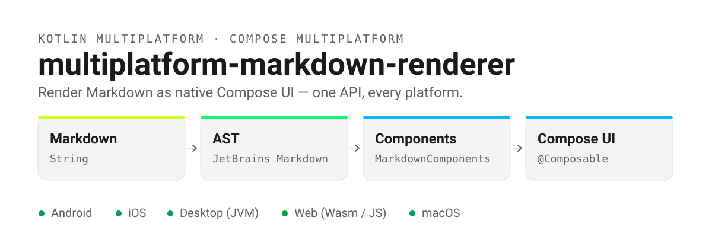
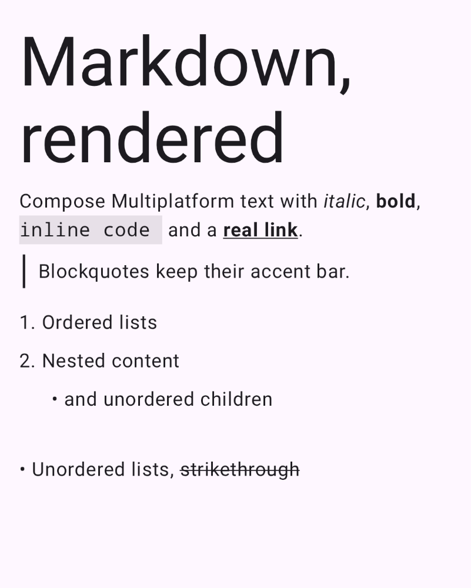
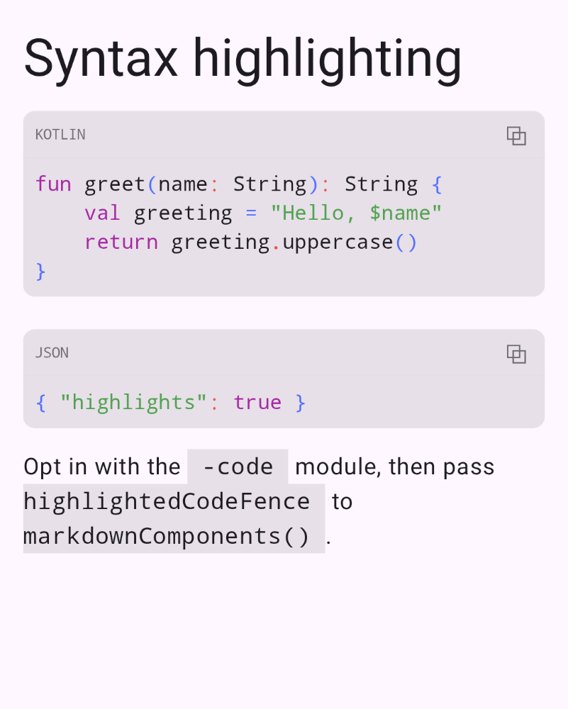
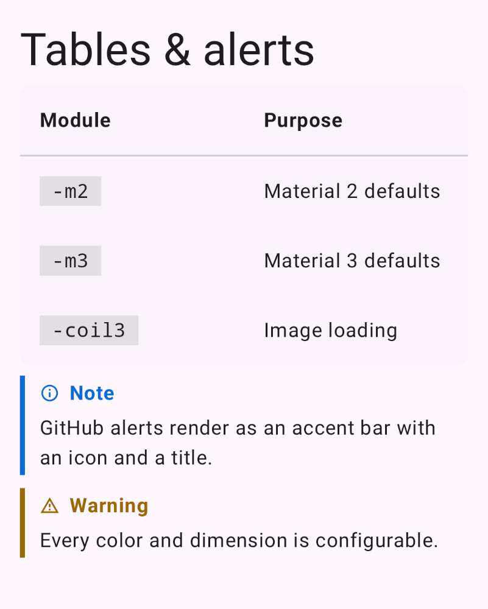
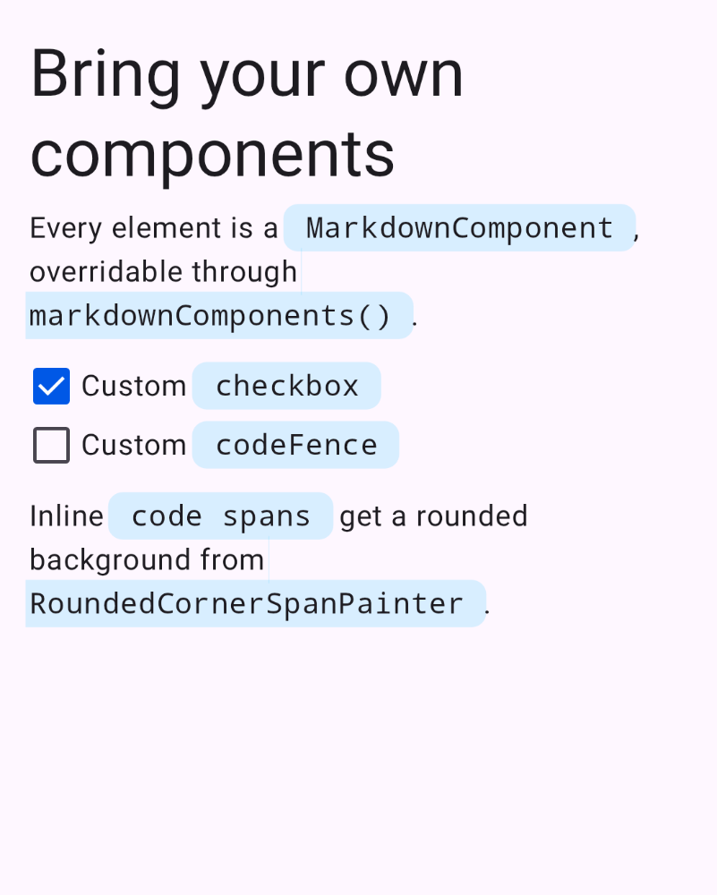

<h1 align="center">multiplatform-markdown-renderer</h1>

<p align="center">
    Render Markdown as native Compose UI — one API, every platform.
</p>

<p align="center">
    <a href="https://github.com/mikepenz/multiplatform-markdown-renderer/actions"></a>
    <a href="https://central.sonatype.com/artifact/com.mikepenz/multiplatform-markdown-renderer"></a>
    <a href="https://scorecard.dev/viewer/?uri=github.com/mikepenz/multiplatform-markdown-renderer"></a>
    <a href="LICENSE"></a>
</p>

<p align="center">
    <picture>
        <source media="(prefers-color-scheme: dark)" srcset="art/hero-dark.svg">
        
    </picture>
</p>

<p align="center">
    <a href="#quickstart">Quickstart</a> &bull;
    <a href="#showcase">Showcase</a> &bull;
    <a href="#reference">Reference</a> &bull;
    <a href="MIGRATION.md">Migration</a> &bull;
    <a href="CHANGELOG.md">Changelog</a>
</p>

| | |
| --- | --- |
| 🧩 **Every platform** | Android, iOS, Desktop (JVM), Web (Wasm / JS) and macOS from one `commonMain` call. |
| ⚡ **Async by default** | `rememberMarkdownState` parses off the composition; `retainState = true` keeps content visible while re-parsing. |
| 🎨 **Material 2 and 3** | Themed defaults from `-m2` / `-m3`; override with `markdownColor()` and `markdownTypography()`. |
| 🧱 **Every element overridable** | `MarkdownComponents` maps each AST node to a `@Composable` you control. |
| 📊 **Full GFM** | Tables, task lists, strikethrough, autolinks and GitHub alerts, out of the box. |
| 📡 **Built for streaming** | `rememberStreamingMarkdownState()` appends chunks and re-parses only the unstable tail. |

## Quickstart

**1 — Add the dependency.** Pick the module matching your Material theme:

```kotlin
dependencies {
    implementation("com.mikepenz:multiplatform-markdown-renderer:0.43.0")
    implementation("com.mikepenz:multiplatform-markdown-renderer-m3:0.43.0") // or -m2
}
```

**2 — Render.** Import `Markdown` from `com.mikepenz.markdown.m3` (or `.m2`):

```kotlin
import com.mikepenz.markdown.m3.Markdown

Markdown(
    """
    # Hello Markdown

    - Bullet points
    - **Bold** and *italic* text

    [Check out this link](https://github.com/mikepenz/multiplatform-markdown-renderer)
    """.trimIndent()
)
```

**3 — Hoist the parse for anything non-trivial.** `rememberMarkdownState` parses asynchronously and
survives recomposition:

```kotlin
val markdownState = rememberMarkdownState(markdown)
Markdown(markdownState)
```

Full configuration — custom components, image loading, syntax highlighting, extended spans — is in
the [Reference](#reference) below.

## Showcase

Every panel below is a Paparazzi snapshot of the sample app, recorded from
[`ReadmeShowcasePreviews.kt`](sample/android/src/main/kotlin/com/mikepenz/markdown/ui/readme/ReadmeShowcasePreviews.kt)
and refreshed by `./gradlew :sample:android:recordPaparazzi :sample:android:copyReadmeArt`.

<p align="center">
    <picture>
        <source media="(prefers-color-scheme: dark)" srcset="art/showcase-rich-text-dark.png">
        
    </picture>
    <picture>
        <source media="(prefers-color-scheme: dark)" srcset="art/showcase-syntax-dark.png">
        
    </picture>
</p>

<p align="center">
    <sub>
        <b>Left:</b> the default <code>Markdown</code> composable — no configuration.
        &nbsp;&nbsp;
        <b>Right:</b> <code>markdownComponents(codeFence = ...)</code> wired to
        <code>MarkdownHighlightedCodeFence</code> from the <code>-code</code> module.
    </sub>
</p>

<p align="center">
    <picture>
        <source media="(prefers-color-scheme: dark)" srcset="art/showcase-tables-alerts-dark.png">
        
    </picture>
    <picture>
        <source media="(prefers-color-scheme: dark)" srcset="art/showcase-custom-dark.png">
        
    </picture>
</p>

<p align="center">
    <sub>
        <b>Left:</b> GFM tables and GitHub alerts, rendered without opt-in.
        &nbsp;&nbsp;
        <b>Right:</b> <code>markdownComponents(checkbox = ...)</code>, <code>markdownColor()</code>
        and <code>markdownExtendedSpans</code> with <code>RoundedCornerSpanPainter</code>.
    </sub>
</p>

-------

# Reference

| Topic | |
| --- | --- |
| [Setup](#setup) | Gradle coordinates for multiplatform, JVM and Android |
| [Usage](#usage) | The `Markdown` composable, state hoisting, and every customisation hook |
| [Streaming](#streaming) | Appending chunks from an LLM or network stream |
| [Image Loading](#image-loading) | Coil 2 and Coil 3 transformers |
| [Syntax Highlighting](#syntax-highlighting) | The optional `-code` module |
| [Dependencies](#dependencies) | What this library builds on |
| [Migration](MIGRATION.md) | Breaking changes between versions |
| [License](#license) | Apache 2.0 |

### What's included 🚀

- **Cross-platform Markdown Rendering** - Works on Android, iOS, Desktop, and Web
- **Material Design Integration** - Seamless integration with Material 2 and Material 3 themes
- **Rich Markdown Support** - Renders headings, lists, code blocks, tables, images, and more
- **Syntax Highlighting** - Optional code syntax highlighting for various programming languages
- **Image Loading** - Flexible image loading with Coil2 and Coil3 integration
- **Customization Options** - Extensive customization for colors, typography, components, and more
- **Performance Optimized** - Efficient rendering with lazy loading support for large documents
- **Extended Text Spans** - Support for advanced text styling with extended spans
- **Lightweight** - Minimal dependencies and optimized for performance

-------

## Setup

### Using Gradle

Choose the appropriate configuration based on your project type:

<details open><summary><b>Multiplatform</b></summary>
<p>

For multiplatform projects, add these dependencies to your `build.gradle.kts`:

```kotlin
dependencies {
    // Core library
    implementation("com.mikepenz:multiplatform-markdown-renderer:${version}")

    // Choose ONE of the following based on your Material theme:

    // For Material 2 themed apps
    implementation("com.mikepenz:multiplatform-markdown-renderer-m2:${version}")

    // OR for Material 3 themed apps
    implementation("com.mikepenz:multiplatform-markdown-renderer-m3:${version}")
}
```

</p>
</details>

<details><summary><b>JVM (Desktop)</b></summary>
<p>

For JVM-only projects, add this dependency:

```kotlin
dependencies {
    implementation("com.mikepenz:multiplatform-markdown-renderer-jvm:${version}")
}
```

</p>
</details>

<details><summary><b>Android</b></summary>
<p>

For Android-only projects, add this dependency:

```kotlin
dependencies {
    implementation("com.mikepenz:multiplatform-markdown-renderer-android:${version}")
}
```

</p>
</details>

> [!IMPORTANT]
> Since version 0.13.0, the core library does not depend on a Material theme. You must include
> either the `-m2` or `-m3` module to get access to the default styling.


-------

## Usage

### Basic Usage

The most basic usage is to simply pass your markdown string to the `Markdown` composable:

```kotlin
// In your composable (use the appropriate Markdown implementation for your theme)
Markdown(
    """
    # Hello Markdown

    This is a simple markdown example with:

    - Bullet points
    - **Bold text**
    - *Italic text*

    [Check out this link](https://github.com/mikepenz/multiplatform-markdown-renderer)
    """.trimIndent()
)
```

> [!NOTE]  
> Import either `com.mikepenz.markdown.m3.Markdown` for Material 3 or
`com.mikepenz.markdown.m2.Markdown` for Material 2 themed applications.

> [!NOTE]  
> By default, when the markdown `content` changes, the component will display a loading state while
> parsing the new content. To keep the previous content visible during updates and avoid showing the
> loading state, set `retainState` to `true`.

<details><summary><b>Advanced Usage</b></summary>
<p>

### `rememberMarkdownState`

For better performance, especially with larger markdown content, use `rememberMarkdownState` or move
the parsing of the markdown into your viewmodel:

```kotlin
val markdownState = rememberMarkdownState(markdown)
Markdown(markdownState)
```

> [!NOTE]  
> Since version 0.33.0, markdown content is parsed asynchronously by default, resulting in a loading
> state being displayed prior to the parsing result. The `rememberMarkdownState` function offers the
> ability to require immediate parsing with the `immediate` parameter, but this is not advised as it
> might block the composition of the UI.

```kotlin
// Default asynchronous parsing (recommended)
val markdownState = rememberMarkdownState(markdown)

// Force immediate parsing (not recommended)
val markdownState = rememberMarkdownState(markdown, immediate = true)
```

#### Retaining State During Updates

By default, when the markdown content changes, the component shows a loading state while parsing the
new content. You can use the `retainState` parameter to keep the previous rendered content visible
while the new content is being parsed:

```kotlin
// Retain previous content during updates (avoids showing loading state)
val markdownState = rememberMarkdownState(
    markdown,
    retainState = true
)
Markdown(markdownState)

// With dynamic content loading
val markdownState = rememberMarkdownState(
    key, // key that triggers re-parsing
    retainState = true
) {
    "# Dynamic content $counter"
}
Markdown(markdownState)
```

This is particularly useful when content updates frequently or when you want to avoid flickering
between the old content and the loading state.

### Lazy Loading for Large Documents

Since version 0.33.0, the library supports rendering large markdown documents efficiently using
`LazyColumn` instead of `Column`. This is particularly useful for very long markdown content.

```kotlin
Markdown(
    markdownState = markdownState,
    success = { state, components, modifier ->
        LazyMarkdownSuccess(state, components, modifier, contentPadding = PaddingValues(16.dp))
    },
    modifier = Modifier.fillMaxSize()
)
```

### Parse Markdown in VM

> [!NOTE]  
> This approach is also advised if you want to retain scroll position even when navigating away
> See: https://github.com/mikepenz/multiplatform-markdown-renderer/issues/374
> Retaining state in the VM ensures parsing will not have to be done again, and the component can be
> immediately filled.

```kotlin
// In the VM setup the flow to parse the markdown
val markdownFlow = parseMarkdownFlow("# Markdown")
    .stateIn(lifecycleScope, SharingStarted.Eagerly, State.Loading())

// In the Composable use the flow
val state by markdownFlow.collectAsStateWithLifecycle()
Markdown(state)
```

### Parse Markdown synchronously

If you want to pre-parse content before showing the UI and hand the result to `Markdown` without any
Flow/StateFlow machinery, use `parseMarkdown`. It parses on the calling thread and returns the final,
immutable `State` directly (`State.Success` on success, or `State.Error` on failure).

```kotlin
// Parse ahead of time and pass the already-parsed state to the Composable
val state = parseMarkdown("# Markdown")
Markdown(state)
```

> [!NOTE]  
> Parsing happens on the calling thread. For large documents consider invoking this off the main
> thread.

The library offers the ability to modify different behaviour when rendering the markdown.

### Provided custom style

```kotlin
Markdown(
    content,
    colors = markdownColor(text = Color.Red),
    typography = markdownTypography(h1 = MaterialTheme.typography.body1)
)
```

### Disable Animation

By default, the `MarkdownText` animates size changes (if images are loaded).

```kotlin
Markdown(
    content,
    animations = markdownAnimations(
        animateTextSize = {
            this
            /** No animation */
        }
    ),
)
```

### Extended spans

Starting with 0.16.0 the library includes support
for [extended-spans](https://github.com/saket/extended-spans).
> The library was integrated to make it multiplatform-compatible.
> All credits for its functionality go to [Saket Narayan](https://github.com/saket).

It is not enabled by default, however you can enable it quickly by configuring the `extendedSpans`
for your `Markdown` composeable.
Define the `ExtendedSpans` you want to apply (including optionally your own custom ones) and return
it.

```kotlin
Markdown(
    content,
    extendedSpans = markdownExtendedSpans {
        val animator = rememberSquigglyUnderlineAnimator()
        remember {
            ExtendedSpans(
                RoundedCornerSpanPainter(),
                SquigglyUnderlineSpanPainter(animator = animator)
            )
        }
    }
)
```

### Extend Annotated string handling

The library already handles a significant amount of different tokens, however not all. To allow
special integrations expand this, you can pass in a custom `annotator` to the `Markdown`
composeable. This `annotator` allows you to customize existing handled tokens, but also add new
ones.

```kotlin
Markdown(
    content,
    annotator = markdownAnnotator { content, child ->
        if (child.type == GFMElementTypes.STRIKETHROUGH) {
            append("Replaced you :)")
            true // return true to consume this ASTNode child
        } else false
    }
)
```

### Adjust List Ordering

```kotlin
// Use the bullet list symbol from the original markdown
CompositionLocalProvider(LocalBulletListHandler provides { type, bullet, index, listNumber, depth -> "$bullet " }) {
    Markdown(content)
}

// Replace the ordered list symbol with `A.)` instead.
CompositionLocalProvider(LocalOrderedListHandler provides { type, bullet, index, listNumber, depth -> "A.) " }) {
    Markdown(content, Modifier.fillMaxSize().padding(16.dp).verticalScroll(scrollState))
}
```

### Custom Components

Since v0.9.0 it is possible to provide custom components, instead of the default ones.
This can be done by providing the components `MarkdownComponents` to the `Markdown` composable.

Use the `markdownComponents()` to keep defaults for non overwritten components.

The `MarkdownComponent` will expose access to
the `content: String`, `node: ASTNode`, `typography: MarkdownTypography`,
offering full flexibility.

```kotlin
// Simple adjusted paragraph with different Modifier.
val customParagraphComponent: MarkdownComponent = {
    Box(modifier = Modifier.fillMaxWidth()) {
        MarkdownParagraph(it.content, it.node, Modifier.align(Alignment.CenterEnd))
    }
}

// Full custom paragraph example 
val customParagraphComponentComplex: MarkdownComponent = {
    // build a styled paragraph. (util function provided by the library)
    val styledText = buildAnnotatedString {
        pushStyle(LocalMarkdownTypography.current.paragraph.toSpanStyle())
        buildMarkdownAnnotatedString(it.content, it.node, annotatorSettings())
        pop()
    }

    // define the `Text` composable
    Text(
        styledText,
        textAlign = TextAlign.End
    )
}

// Define the `Markdown` composable and pass in the custom paragraph component
Markdown(
    content,
    components = markdownComponents(
        paragraph = customParagraphComponent // customParagraphComponentComplex
    )
)
```

Another example to of a custom component is changing the rendering of an unordered list.

```kotlin
// Define a custom component for rendering unordered list items in Markdown
val customUnorderedListComponent: MarkdownComponent = {
    // Use the MarkdownListItems composable to render the list items
    MarkdownListItems(it.content, it.node, depth = 0) { startNumber, index, child ->
        // Render an icon for the bullet point with a green tint
        Icon(
            imageVector = icon,
            tint = Color.Green,
            contentDescription = null,
            modifier = Modifier.size(20.dp),
        )
    }
}

// Define the `Markdown` composable and pass in the custom unorderedList component
Markdown(
    content,
    components = markdownComponents(
        unorderedList = customUnorderedListComponent
    )
)
```

### Table Support

Starting with 0.30.0, the library includes support for rendering tables in markdown. The `Markdown`
composable will automatically handle table elements in your markdown content.

```kotlin
val markdown = """
| Header 1 | Header 2 |
|----------|----------|
| Cell 1   | Cell 2   |
| Cell 3   | Cell 4   |
""".trimIndent()

Markdown(markdown)
```

### Alert Support

The library renders [GitHub alerts](https://github.com/orgs/community/discussions/16925) — `NOTE`,
`TIP`, `IMPORTANT`, `WARNING` and `CAUTION` — as an accent bar with an icon and a title.

```kotlin
val markdown = """
> [!NOTE]
> Useful information that users should know, even when skimming content.
""".trimIndent()

Markdown(markdown)
```

The accent colors, dimensions and paddings are grouped into dedicated models, the title style is
exposed via `markdownTypography(alertTitle = ...)`:

```kotlin
Markdown(
    markdown,
    colors = markdownColor(alert = markdownAlertColors(note = Color.Blue)),
    dimens = markdownDimens(alert = markdownAlertDimens(barThickness = 2.dp)),
    padding = markdownPadding(alert = markdownAlertPadding(iconSpacing = 12.dp)),
)
```

The icons are swappable via `LocalMarkdownAlertIcons`:

```kotlin
CompositionLocalProvider(
    LocalMarkdownAlertIcons provides markdownAlertIcons(note = Icons.Outlined.Info)
) {
    Markdown(markdown)
}
```

To fully replace the rendering, override the `alert` component through `markdownComponents()`.

</p>
</details>

## Streaming

For content that arrives in chunks — an LLM response, a network stream — use
`rememberStreamingMarkdownState()`. It is append-only: each `append` re-parses only the unstable
tail of the document rather than the whole string.

```kotlin
val streamingMarkdownState = rememberStreamingMarkdownState()

LaunchedEffect(chunkFlow) {
    chunkFlow.collect { chunk -> streamingMarkdownState.append(chunk) }
}

Markdown(streamingMarkdownState = streamingMarkdownState)
```

If the chunks already arrive as a `Flow<String>`, `collectAsStreamingMarkdownState()` does the
collecting for you:

```kotlin
val streamingMarkdownState = chunkFlow.collectAsStreamingMarkdownState()
Markdown(streamingMarkdownState = streamingMarkdownState)
```

`StreamingMarkdownState.snapshot` exposes the split as a `StateFlow<Snapshot>` with `stableAst` and
`unstableAstTail`, if you need to observe it. See `StreamingMarkDownPage` in the sample for a
working example including render statistics.

### Image Loading

To configure image loading, the library offers different implementations, to offer great flexibility
for the respective integration.
After adding the dependency, the chosen image transformer implementation has to be passed to the
`Markdown` API.

> [!NOTE]  
> Please refer to the official documentation for the specific image loading integration you are
> using (e.g., coil3) on how to adjust its
> behavior.

#### coil3

```groovy
// Offers coil3 (Coil3ImageTransformerImpl)
implementation("com.mikepenz:multiplatform-markdown-renderer-coil3:${version}")
```

```kotlin
Markdown(
    MARKDOWN,
    imageTransformer = Coil3ImageTransformerImpl,
)
```

#### coil2

```groovy
// Offers coil2 (Coil2ImageTransformerImpl)
implementation("com.mikepenz:multiplatform-markdown-renderer-coil2:${version}")
```

```kotlin
Markdown(
    MARKDOWN,
    imageTransformer = Coil2ImageTransformerImpl,
)
```

### Syntax Highlighting

The library (introduced with 0.27.0) offers optional support for syntax highlighting via
the [Highlights](https://github.com/SnipMeDev/Highlights) project.
This support is not included in the core, and can be enabled by adding the
`multiplatform-markdown-renderer-code`
dependency.

```groovy
implementation("com.mikepenz:multiplatform-markdown-renderer-code:${version}")
```

Once added, the `Markdown` has to be configured to use the alternative code highlighter.

```kotlin
// Use default color scheme
Markdown(
    MARKDOWN,
    components = markdownComponents(
        codeBlock = highlightedCodeBlock,
        codeFence = highlightedCodeFence,
    )
)

// ADVANCED: Customize Highlights library by defining different theme
val isDarkTheme = isSystemInDarkTheme()
val highlightsBuilder = remember(isDarkTheme) {
    Highlights.Builder().theme(SyntaxThemes.atom(darkMode = isDarkTheme))
}
Markdown(
    MARKDOWN,
    components = markdownComponents(
        codeBlock = {
            MarkdownHighlightedCodeBlock(
                content = it.content,
                node = it.node,
                highlightsBuilder = highlightsBuilder,
                showHeader = true, // optional enable header with code language + copy button
            )
        },
        codeFence = {
            MarkdownHighlightedCodeFence(
                content = it.content,
                node = it.node,
                highlightsBuilder = highlightsBuilder,
                showHeader = true, // optional enable header with code language + copy button
            )
        },
    )
)
```

## Dependencies

This library uses the following key dependencies:

- [JetBrains Markdown](https://github.com/JetBrains/markdown/) - Multiplatform Markdown processor
  for parsing markdown content
- [Compose Multiplatform](https://github.com/JetBrains/compose-multiplatform) - For cross-platform
  UI rendering
- [Extended Spans](https://github.com/saket/extended-spans) - For advanced text styling (integrated
  as multiplatform)
- [Highlights](https://github.com/SnipMeDev/Highlights) - For code syntax highlighting (optional)

## Developed By

* Mike Penz
* [mikepenz.com](http://mikepenz.com) - <mikepenz@gmail.com>
* [paypal.me/mikepenz](http://paypal.me/mikepenz)

## Contributors

This free, open source software was made possible by a group of volunteers who put many hours of
hard work into it. See the [CONTRIBUTORS.md](CONTRIBUTORS.md) file for details.

## Credits

Big thanks to [Erik Hellman](https://twitter.com/ErikHellman) and his awesome article
on [Rendering Markdown with Jetpack Compose](https://www.hellsoft.se/rendering-markdown-with-jetpack-compose/),
and the related source [MarkdownComposer](https://github.com/ErikHellman/MarkdownComposer).

Also huge thanks to [Saket Narayan](https://github.com/saket/) for his great work on
the [extended-spans](https://github.com/saket/extended-spans) project, which was ported into this
project to make it multiplatform.

## Fork License

Copyright for portions of the code are held by [Erik Hellman, 2020] as part of
project [MarkdownComposer](https://github.com/ErikHellman/MarkdownComposer) under the MIT license.
All other copyright for project multiplatform-markdown-renderer are held by [Mike Penz, 2023] under
the Apache License, Version 2.0.

## License

    Copyright 2026 Mike Penz

    Licensed under the Apache License, Version 2.0 (the "License");
    you may not use this file except in compliance with the License.
    You may obtain a copy of the License at

       http://www.apache.org/licenses/LICENSE-2.0

    Unless required by applicable law or agreed to in writing, software
    distributed under the License is distributed on an "AS IS" BASIS,
    WITHOUT WARRANTIES OR CONDITIONS OF ANY KIND, either express or implied.
    See the License for the specific language governing permissions and
    limitations under the License.
